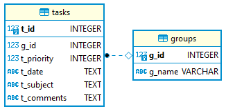

# sdm_demo_fastapi_no_orm_scenario

Quick Demo of how to use [SQL DAL Maker](https://github.com/panedrone/sqldalmaker) + Python/FastAPI/no-ORM-scenario.

Front-end is written in Vue.js. SQLite3 is used as a database.




dto.xml

```xml

<dto-classes>

    <dto-class name="Project" ref="projects"/>

    <dto-class name="ProjectLi" ref="get_projects.sql"/>

    <dto-class name="Task" ref="tasks"/>

    <dto-class name="TaskLi" ref="get_project_tasks.sql"/>

</dto-classes>
```

ProjectsDao.xml

```xml

<dao-class>

    <crud dto="Project"/>

    <query-dto-list dto="ProjectLi" method="get_projects"/>

</dao-class>
```

TasksDao.xml

```xml

<dao-class>

    <crud dto="Task"/>

    <query-dto-list dto="TaskLi" method="get_project_tasks(p_id)"/>

    <exec-dml ref="task_update.sql" method="update_task(t_priority, t_date, t_subject, t_comments, t_id)"/>

</dao-class>
```

Generated code in action:

```python
from typing import List
from fastapi import Depends, FastAPI
from db import get_ds
from dbal.data_store import DataStore
from dbal.project import Project
from dbal.projects_dao import ProjectsDao
from schemas import *

app = FastAPI(title="SDM + Python/FastAPI/no-ORM-scenario",
              description="Quick Demo of how to use SQL DAL Maker + Python/FastAPI/no-ORM-scenario",
              version="1.0.0", )


@app.get('/api/projects', tags=["ProjectList"], response_model=List[SchemaProjectLi])
def get_all_projects(ds: DataStore = Depends(get_ds)):
    return ProjectsDao(ds).get_projects()


@app.post('/api/projects', tags=["ProjectList"], status_code=201)
async def project_create(item_request: SchemaProjectCreateUpdate, ds: DataStore = Depends(get_ds)):
    project = Project()
    project.p_name = item_request.p_name
    ProjectsDao(ds).create_project(project)
    ds.commit()


@app.get('/api/projects/{p_id}', tags=["Project"], response_model=SchemaProject)
def project_read(p_id: int, ds: DataStore = Depends(get_ds)):
    pr = Project()
    ProjectsDao(ds).read_project(p_id, pr)
    return pr


@app.put('/api/projects/{p_id}', tags=["Project"])
async def project_update(p_id: int, item_request: SchemaProjectCreateUpdate, ds: DataStore = Depends(get_ds)):
    pr = Project()
    pr.p_id = p_id
    pr.p_name = item_request.p_name
    ProjectsDao(ds).update_project(pr)
    ds.commit()


@app.delete('/api/projects/{p_id}', tags=["Project"], status_code=204)
async def project_delete(p_id: int, ds: DataStore = Depends(get_ds)):
    ProjectsDao(ds).delete_project(p_id)
    ds.commit()
```